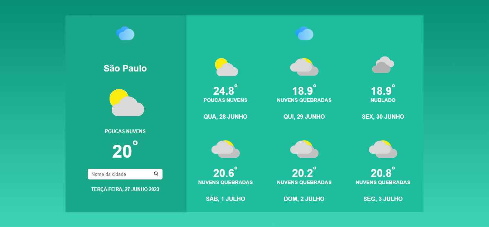

# WeatherNow
# Aplicação de Tempo Atual - HTML, CSS, React.js e Vite

Este repositório contém um projeto de uma aplicação de tempo atual, desenvolvido utilizando HTML, CSS, React.js e Vite. A aplicação tem como objetivo fornecer a temperatura atual de uma cidade com base em consultas à API da Weatherbit.io. Este projeto foi desenvolvido no início do aprendizado em React.js e utiliza o Vite como ferramenta de desenvolvimento rápida.

<a href="https://deveduardosouza.github.io/WeatherNow/#/home">Link do site</a>
 
90% completo

## Descrição

A aplicação de tempo atual é uma aplicação web que utiliza a API da Weatherbit.io para consultar e exibir a temperatura atual de uma cidade informada pelo usuário. Ao digitar o nome da cidade na caixa de busca e pressionar o botão "Buscar" ou pressione "ENTER", a aplicação faz uma chamada à API e exibe a temperatura atual em graus Celsius. A interface é simples e minimalista, com um design limpo e intuitivo.

## Funcionalidades

- Consulta a temperatura atual de uma cidade utilizando a API da Weatherbit.io
- Exibição da temperatura em graus Celsius
- Interface de usuário simples e intuitiva

## Tecnologias Utilizadas

- HTML5
- CSS3
- React.js
- Vite

## Como Usar

1. Clone ou faça o download deste repositório para o seu ambiente local.

2. Abra o terminal e navegue até o diretório do projeto.

3. Execute o comando `npm install` para instalar as dependências do projeto.

4. Execute o comando `npm run dev` para iniciar o servidor de desenvolvimento com o Vite.

5. Abra o navegador e acesse `http://localhost:3000` para visualizar a aplicação.

6. Digite o nome de uma cidade na caixa de busca e pressione o botão "Buscar".

7. A aplicação irá exibir a temperatura atual da cidade consultada.

## Contribuindo

Este projeto foi desenvolvido com o propósito de aprendizado e, portanto, não são aceitas contribuições externas neste momento.

## Licença

Este projeto é apenas para fins educacionais e não possui uma licença específica.

